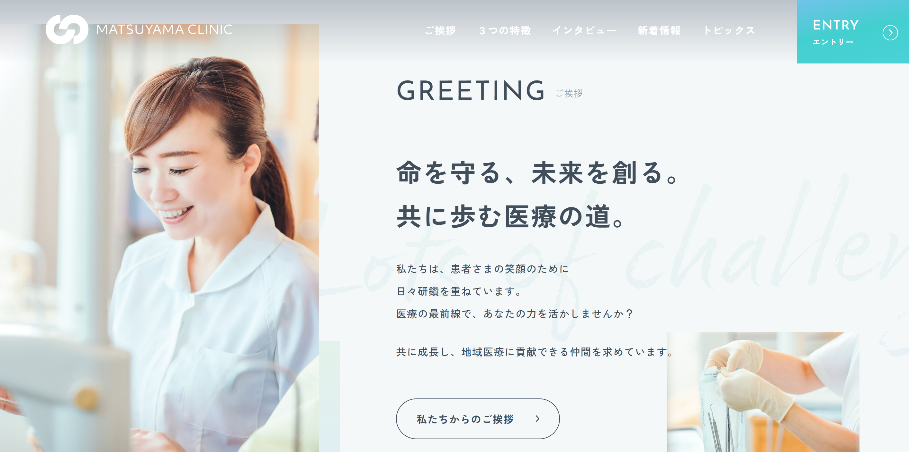

# 🌿 matsuyama-clinic（架空サイト）

**🔗 デモ URL:** https://hiron-folio.com/portfolio/lp/matsuyama-clinic/

HelloMentorの課題で作成したLP。

---

### 🖥 使用技術

HTML / SCSS / JavaScript

### 🚀 制作ポイント

- デザイン再現性を重視し、余白やフォントサイズを **remベースで統一管理**  
- SCSSをセクションごとに分割し、BEMで統一したクラス設計
- グラデーションを忠実に再現
- レスポンシブ対応（SP・PC）

## 🧭 開発環境（概要）

### 推奨エディターと拡張機能（Cursor / VS Code）

- **Live Sass Compiler**：SCSS のリアルタイムコンパイル
- **Prettier**：SCSS / JS / JSON 等のコード整形
